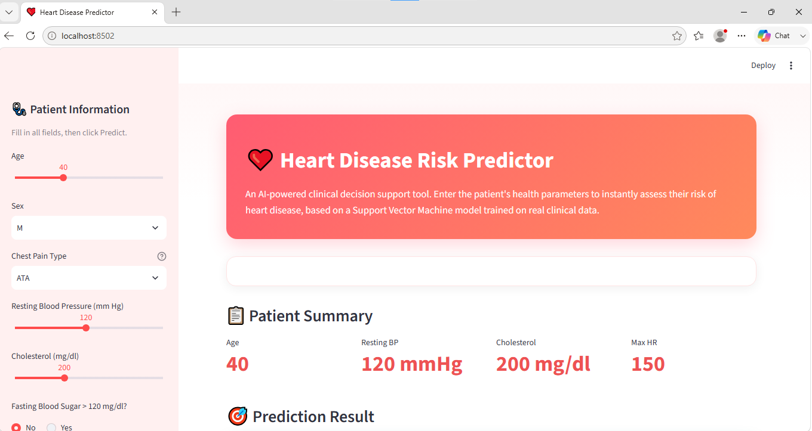
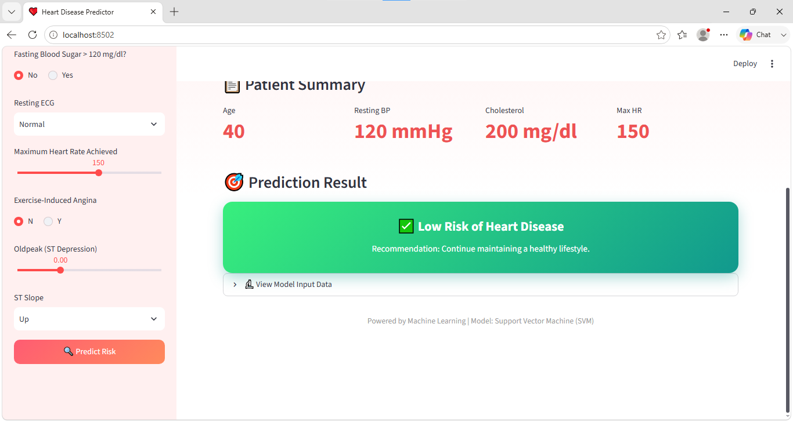

# Heart Disease Prediction App

An end-to-end machine learning project that predicts a patient's risk of heart disease based on clinical parameters, deployed as an interactive web application built with **Streamlit**.

---

##  Project Overview

Heart disease is one of the leading causes of death worldwide, and early risk assessment can make a real difference. This project walks through the complete machine learning lifecycle — from raw clinical data to a deployed, interactive prediction tool:

1. **Explored and cleaned** a real-world clinical dataset of 918 patients.
2. **Statistically validated** which features actually matter using Pearson correlation and Chi-Square tests, instead of guessing.
3. **Trained and compared 5 classification models** to find the best performer.
4. **Deployed the winning model** inside a clean, interactive Streamlit web app that anyone can use — no coding knowledge required.

The result is a tool where a user enters basic health parameters (age, blood pressure, cholesterol, etc.) and instantly gets a **High Risk** or **Low Risk** prediction for heart disease.

---

## Dataset

- **File:** `heart.csv`
- **Records:** 918 patients
- **Original Features:** Age, Sex, Chest Pain Type, Resting Blood Pressure, Cholesterol, Fasting Blood Sugar, Resting ECG, Max Heart Rate, Exercise-Induced Angina, Oldpeak (ST Depression), ST Slope
- **Target Variable:** `HeartDisease` (1 = heart disease present, 0 = no heart disease)

---

##  What I Did — Step by Step

### 1. Data Cleaning
Some records had invalid `0` values in `Cholesterol` and `RestingBP` (which is physiologically impossible). These were replaced with the column mean rather than dropped, to preserve as much data as possible.

### 2. Exploratory Data Analysis (EDA)
Used Seaborn and Matplotlib to study the distribution of numerical features (Age, Cholesterol, MaxHR, RestingBP), check class balance in the target variable, and visualize relationships between features.

### 3. Encoding
Converted categorical columns (Sex, ChestPainType, RestingECG, ExerciseAngina, ST_Slope) into numerical form using one-hot encoding (`pd.get_dummies(drop_first=True)`), which avoids redundant columns and the dummy variable trap.

### 4. Feature Selection (the part I'm proudest of)
Rather than using all features blindly, I statistically tested each one:
- **Pearson correlation** — measured how strongly numerical/binary features correlate with `HeartDisease`.
- **Chi-Square test** — tested whether categorical features have a statistically significant relationship with the target (using a significance threshold of α = 0.05).

Features that failed the significance test (like `ChestPainType_TA`) were dropped, leaving a final, statistically justified set of 14 features.

### 5. Model Training & Comparison
Split the data 67/33 (train/test), scaled the features using `StandardScaler`, and trained 5 different classification algorithms to compare their performance fairly.

### 6. Model Selection & Saving
Picked the best-performing model based on Accuracy and F1 Score, then saved the trained model, the scaler, and the exact feature column order using `joblib` — so the exact same preprocessing can be reproduced at prediction time.

### 7. Deployment as a Web App
Built an interactive **Streamlit** front-end where a user fills in patient details through sliders and dropdowns, and gets an instant, visually clear prediction — without ever touching the underlying code or notebook.

---

##  Model Performance

| Model               | Accuracy | F1 Score |
|---------------------|----------|----------|
| Logistic Regression | 0.8515   | 0.8696   |
| K-Nearest Neighbors | 0.8482   | 0.8671   |
| Naive Bayes         | 0.8548   | 0.8728   |
| Decision Tree       | 0.7360   | 0.7561   |
| **SVM (Selected)**  | **0.8647** | **0.8845** |

The **Support Vector Machine (SVM)** achieved the highest accuracy and F1 score and was selected as the final model powering the app.

---

##  Application Screenshots

**Input form — entering patient details:**



**Prediction result — instant risk assessment:**



---

##  Running the App Locally

1. **Clone the repository**
   ```bash
   git clone https://github.com/ishikasharma871/Heart-Disease-Prediction-App.git
   cd Heart-Disease-Prediction-App
   ```

2. **Install dependencies**
   ```bash
   pip install -r requirements.txt
   ```

3. **Run the app**
   ```bash
   streamlit run app.py
   ```

4. Open the local URL shown in the terminal (usually `http://localhost:8501`) in your browser.

>  A live hosted demo is not available yet — this project currently runs locally. (Coming soon!)

---

##  Tech Stack

- **Language:** Python
- **Data Analysis:** Pandas, NumPy
- **Visualization:** Matplotlib, Seaborn
- **Statistical Testing:** SciPy (Pearson correlation, Chi-Square test)
- **Machine Learning:** Scikit-learn (Logistic Regression, KNN, Naive Bayes, Decision Tree, SVM)
- **Model Persistence:** Joblib
- **Web App:** Streamlit

---

##  Repository Structure

```
Heart-Disease-Prediction-App/
├── app.py                       # Streamlit web application
├── EDA_1Heart_complete.ipynb    # Full EDA, feature selection & model training notebook
├── heart.csv                    # Dataset
├── SVM_heart.pkl                # Trained SVM model
├── scaler.pkl                   # StandardScaler used for feature scaling
├── columns.pkl                  # Feature column order expected by the model
├── requirements.txt             # Python dependencies
├── screenshot-form.png          # App screenshot — input form
├── screenshot-result.png        # App screenshot — prediction result
└── README.md                    # Project documentation
```

---

##  Future Improvements

- Enable `probability=True` in the SVM model to show prediction confidence percentages in the app
- Deploy the app publicly via Streamlit Community Cloud for a live, shareable link
- Add model explainability (e.g., SHAP values) to show which features most influenced a given prediction
- Tune hyperparameters to improve the Decision Tree's comparatively weaker performance

---


 If you found this project useful, consider giving it a star!
